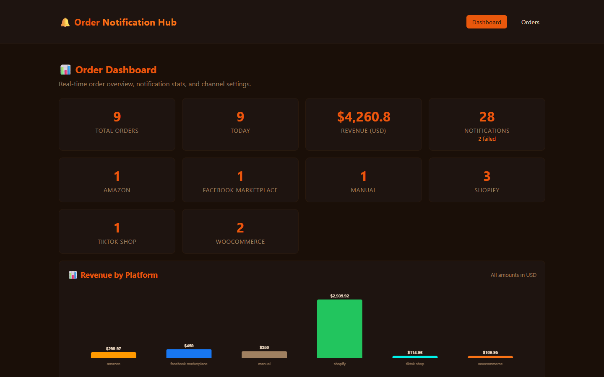
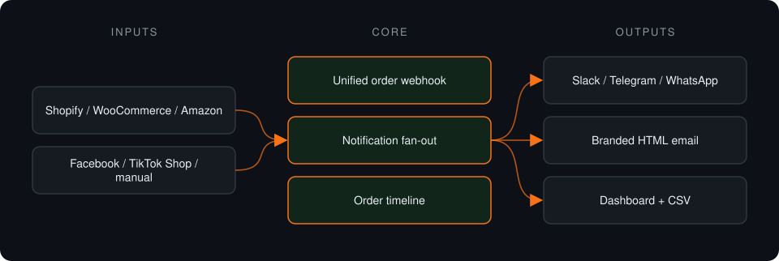
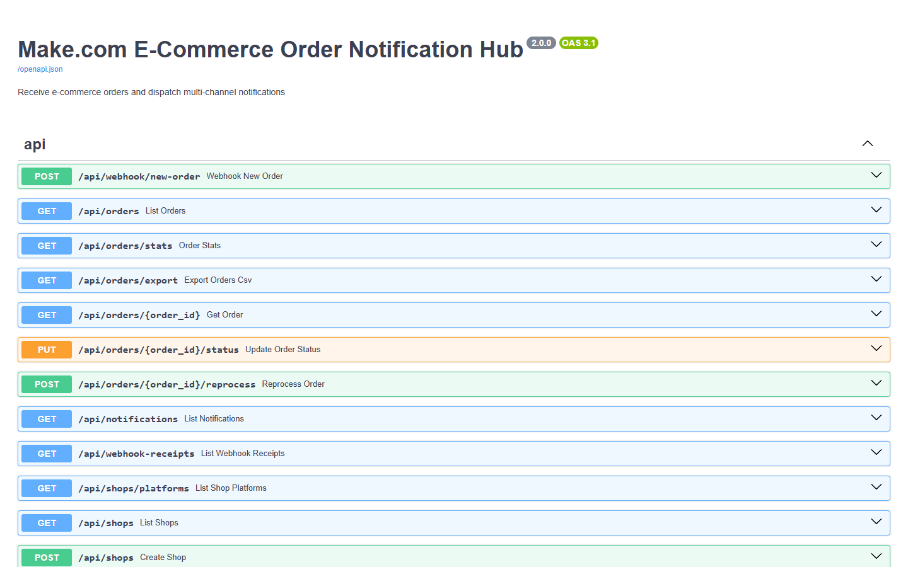

# Make E-Commerce Notifications

**One webhook endpoint that normalizes orders from six store platforms and fans notifications out to Slack, Telegram, WhatsApp and branded email. Channel delivery is mocked in this version.**

> **This is a proprietary project. Source code is private. This page showcases the system's architecture and results.**

**Case study page:** [https://jryahia.github.io/showcase-make-ecommerce-notifications/](https://jryahia.github.io/showcase-make-ecommerce-notifications/)

## Problem it solves

Shops selling on several platforms get order alerts in several places, or not at all. This hub accepts orders from all of them and notifies the team on the channels they actually watch. It is built as the webhook backend for a Make.com scenario: the automation platform handles triggers, and this service holds the logic and data.

## Architecture

1. An order arrives from any connected platform at a single webhook.
2. It is normalized and stored with a timeline.
3. Notifications go out to each enabled channel; high-value orders are flagged.
4. Every attempt is logged and can be reprocessed.

## Key features

- Six store platforms on one endpoint
- Four notification channels
- High-value order alerts
- Raw webhook log for debugging
- CSV export and reprocessing

## Tech stack

      

## What it does in practice

- Prototype stage: order intake, normalization, timeline, logging and reprocessing are built; the channel senders are mocks with simulated failures for testing retries.

## Screenshots

> Screenshots show the app running on seeded demo data, not client data.

**Orders and revenue by platform**

**API surface: unified order webhook, notifications, exports**

---

Built by [Yahya Jarray](https://github.com/jryahia). Interested in a similar system? [Get in touch](mailto:yahiajarray43@gmail.com).

This repository contains no source code. It is a case study for a proprietary project. © Yahya Jarray.
